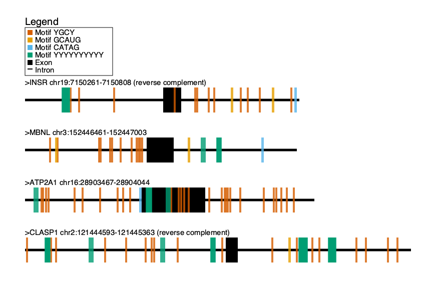

# Bi625 Motif Mark OOP #
This script is for visualizing motif sites on DNA or RNA sequences, using a graphical representation. 

## Input
* ".fasta" or ".fa" file, introns must be lower-case and exons must be upper-case
* motif file (.txt), one motif per line, case insensitive
Package requirements: cairo, argparse, re, os

Command line prompt: 
    ./motif-mark-oop.py -f [Input Fasta File].fasta -m [Input Motif File].txt
Options:
    -f FASTA input file
    -m Motif file (.txt)

## Output
* one .png image with the same prefix as the input fasta file. 

## Assignment Requirements (from Bi625 Canvas):

### Minimum Requirements
* Well commented, Python3 compatible, object-oriented code, with CLEAR readme.md file
* Public GitHub repo named motif-mark [WARNING! Assignment will not be graded if repo incorrectly named!]
* Script named motif-mark-oop.py [WARNING! Assignment will not be graded if script incorrectly named!]
* Use argparse with options: [WARNING! Assignment will not be graded if argparse options not as requested!]
    * -f: fasta file
    * -m: motifs file
* Output file has same prefix as input file (e.g. Figure_1.fa -> Figure_1.png)
* Input FASTA file (seqs ≤1000 bases) and motifs file (≤10 bases each, one motif per line in a text file)
* Capable of handling:
    * Motifs with ambiguous nucleotides (see https://en.wikipedia.org/wiki/Nucleic_acid_notationLinks to an external site.)
    * Multiple sequences (max 10 in the data you will be provided)
    * Multiple motifs (max 5 in the data you will be provided)
* Consider:
    * How you will handle overlapping motifs
    * How you will denote introns/exons
* All features (motifs, introns, exons) should be to scale
* Output single, well-labeled figure, per FASTA file
* png output
* Key/labeling
* Should be able to be run in the following environment:
    * conda create -n my_pycairo pycairo
    * conda activate my_pycairo
    * [WARNING! Assignment will not be graded if other packages are required!]

### Stretch goals
* Staggered drawing of motifs (along the y-axis) to better show position of overlapping motifs
* Transform information in FASTA header to more readable figure title

### Example Output ###
